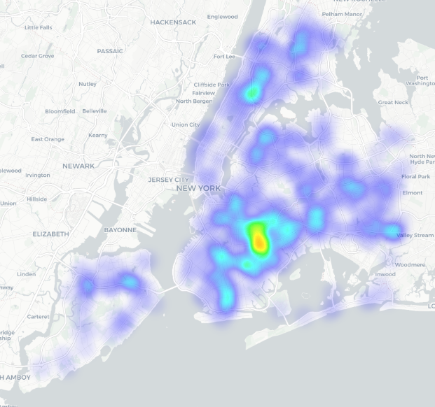
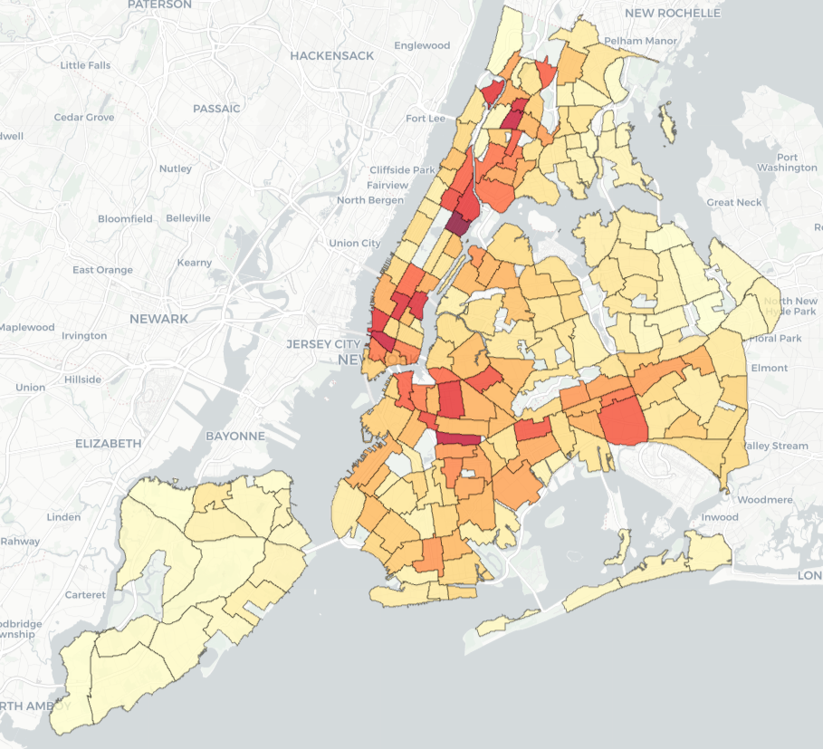

```{r}
#| include: false

source("code/17_quarto_code.R")
```

# Overview

New York City's red light camera program was authorized by the New York State Legislature in 1993 and launched in 1994, making it one of the first automated traffic enforcement programs in the United States. Over the following three decades, the program was repeatedly renewed by the state and gradually expanded, but for most of its history state law limited cameras to just 150 intersections. 

It's clear from the data that red light cameras are very effective: a 2024 study by the NYC Department of Transportation found that at intersections equipped with cameras, observed red light violations declined by 73 percent and T-bone crashes fell by 65 percent compared with conditions before camera installation. However, red light running increased significantly following the COVID-19 pandemic, with the average number of daily violations recorded by cameras rising by 54 percent between 2020 and 2024. In response, the New York State Legislature passed a bill in 2024 expanding the maximum number of camera locations from 150 to 600 intersections, the largest expansion in the program's history. Although the expansion was authorized in 2024, large-scale deployment did not begin until after the change in administration in 2026. As of July 2026, the Department of Transportation had installed cameras at 531 intersections and plans to reach the new cap of 600 intersections by the end of the year.

Historically, cameras were concentrated at the city's most dangerous intersections because of the strict statutory cap. This helped prevent crashes at dangerous intersections, but did little to deter running red lights as a whole. An analysis of the historic locations of red light cameras finds little to no bias in their placement, as the locations of dangerous intersections are relatively homogenous throughout the city.  However, the recent expansion has allowed planners to move beyond a purely crash-based deployment strategy and place cameras on a wider range of streets, including residential corridors where drivers may previously have perceived a low risk of enforcement or danger to themselves when running a red light. This shift has the potential to transform red light cameras from a targeted safety intervention into a broader deterrent against red light running across the city.

# Camera Locations

The Department of Transportation does not publicly release the locations of its red light cameras, as doing so would allow drivers to identify intersections without automated enforcement. However, the DOT does publish the location of all red light violations, including those issued by cameras. Because relatively few red light tickets are issued directly by police officers, it is possible to approximate camera locations by identifying intersections that generate large numbers of red light violations. For this analysis, we identified intersections with more than 25 red light tickets issued between January 1 and June 30, 2026.

Our analysis identified 470 intersections with active red light cameras as of June 30, 2026. This differs from the Department of Transportation's reported total of 531 camera-equipped intersections. The discrepancy is likely the result of differing definitions of an "intersection," as some adjacent intersections may be legally distinct while functioning as a single location in practice. It is also possible that some cameras had been installed but were not yet active during the study period. **Figure 1** shows a density heatmap of identified red light camera locations across New York City:

## Figure 1: Heatmap of Red Light Cameras

```{r, out.width='60%', fig.align='center'}

```

#

As the map shows, the highest density of red light cameras is in East Brooklyn neighborhoods such as Crown Heights, Brownsville, and Flatbush. There are also noticable gaps in coverage, including Midtown Manhattan, Riverdale and Throggs Neck in the Bronx, and Bayside and Maspeth in Queens. 

When evaluating the distribution of red light cameras, it is also important to consider where red light violations are most likely to occur. One way to estimate this is through crash data published by the Department of Transportation. The DOT records contributing factors for each crash, including incidents in which "Traffic Control Disregarded" is identified as a contributing factor. Although this category captures a broader range of traffic violations than just red light running, the prevalence of such crashes serves as a useful proxy for identifying areas where drivers are more likely to disregard traffic signals.

## Figure 2: 'Traffic Control Disregarded' Crashes by Neighborhood

```{r, out.width='75%', fig.align='center'}

```

*(Note: Data is from 2025, before the new red light cameras were installed)*

Looking at this map, the highest rates of "Traffic Control Disregarded" crashes are concentrated in Midtown and Lower Manhattan, Harlem, and the South Bronx. Elevated crash rates are also visible in parts of eastern Brooklyn and southeastern Queens, although they are generally lower than those observed in Manhattan and the Bronx. If camera placement closely reflected the distribution of signal-related crashes, one would expect the density of red light cameras to roughly mirror these patterns. However, the two maps suggest a different distribution. Several crash hotspots in Midtown and Lower Manhattan have relatively limited camera coverage, while portions of eastern Brooklyn contain a higher concentration of cameras than crash patterns alone would suggest. 


# Analysis 

## Regression Model, accounting for Crashes and Race

```{r}
rl_table
```

#

To better understand the factors associated with the placement of red light cameras, we used a negative binomial regression model to predict the number of camera-equipped intersections in each neighborhood. The model includes the number of crashes with "Traffic Control Disregarded" as a contributing factor as a proxy for red light running. The model also includes the ethnic composition of each neighborhood in order to understand if there were any further correlations between the placement of red light cameras and race. Area was also included as a normalizing variable to account for differences in geographic size among neighborhoods.

Using demographic data from the U.S. Census Bureau, the model includes the percentage of neighborhood residents identifying as Black, Hispanic, and Asian as explanatory variables. All residents identifying as Hispanic or Latino were included in the Hispanic category, with the other racial categories only including non-Hispanic individuals. The percentage of non-Hispanic White residents was omitted from the model and serves as the reference category. As a result, the coefficients for the remaining demographic variables should be interpreted as the number of cameras relative to otherwise similar neighborhoods with larger non-Hispanic White populations.

The results confirm that crash prevalence is a statistically significant predictor of camera placement. The positive coefficient for related crashes is highly significant (p < 0.001), indicating a strong relationship between crash history and camera deployment. As one would expect, neighborhoods with higher rates of crashes involving disregarded traffic controls tend to have more red light cameras. However, crash rates do not fully explain the observed distribution of cameras. The coefficient for percentage Black is particularly large and statistically significant, indicating that even after controlling for crash prevalence, neighborhoods with a larger Black population are associated with significantly higher concentrations of red light cameras.

# Conclusion

When considering the results of this study, it's important to remember that camera placement is influenced by other factors not included in this analysis, including roadway design, traffic volumes, pedestrian activity, school locations, and operational considerations. However, regardless of the motivations behind the locations of the cameras, the results do indicate that majority-Black neighborhoods in New York City have a higher number of red light cameras than the number of crashes would warrant.

The expansion of New York City's red light camera program is still underway, making any conclusions necessarily preliminary. Although state law now permits cameras at up to 600 intersections, only about 530 intersections had cameras installed as of July 2026. The remaining camera deployments provide the city an opportunity to address some of the geographic imbalances identified in this report. Several areas with relatively little camera coverage in Manhattan, the Bronx, and Queens could be prioritized as the final seventy or so intersections are brought online. 

None of these findings should obscure the broader success of red light cameras as a safety intervention. Evidence from the Department of Transportation shows substantial reductions in both red light violations and severe side-impact crashes at camera-equipped intersections. As New York City continues pursuing its Vision Zero goals, red light cameras remain one of the most effective tools available for reducing dangerous driving behavior and preventing serious injuries and fatalities. The key challenge going forward will be ensuring that the benefits of the program are realized equitably across all neighborhoods while preserving its demonstrated safety impact.

# Sources
https://www.nyc.gov/html/dot/downloads/pdf/nyc-red-light-camera-program.pdf